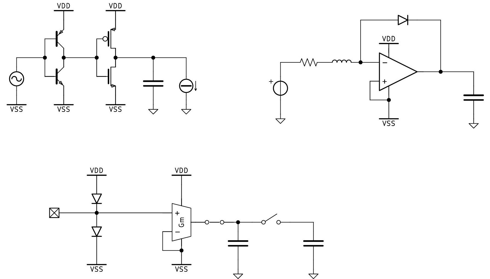
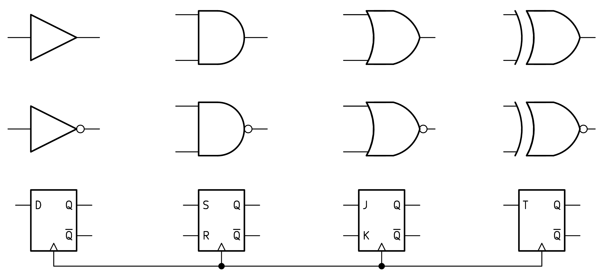

**DRAW ANALOG/DIGITAL circuits**

Download [Kicad](https://github.com/KiCad)

Use the **symbol editor** to load the analog library (ANALOG_DRAW.kicad_sym):

    

 and the digital library (DIGITAL_DRAW.kicad_sym):

    

Use the **schematic editor** to draw your circuits :
*  press A to select the components 
*  press R to rotate the components, X to mirror horizontally, Y to mirror vertically 
*  press CTRL-C/ CTRL-V to copy the components 
*  press W to create a wire
*  press T to add text or node names  

Click on File/Plot to export your work in PDF, SVG format ... 

___________________________________________________________________
**DRAW DIGITAL signals** 

Download [WaveDrom](https://github.com/wavedrom/wavedrom)

___________________________________________________________________
**DRAW ANALOG signals** 

Use [Octave](https://github.com/gnu-octave) if the signals are made up of basic functions (e.g. step, ramp, sine...)

Use [Xfig](https://mcj.sourceforge.net/frm_introduction.html) if you need to draw complex spline signals 

Use [Inkscape](https://github.com/inkscape/inkscape) to post-process the result.
 
